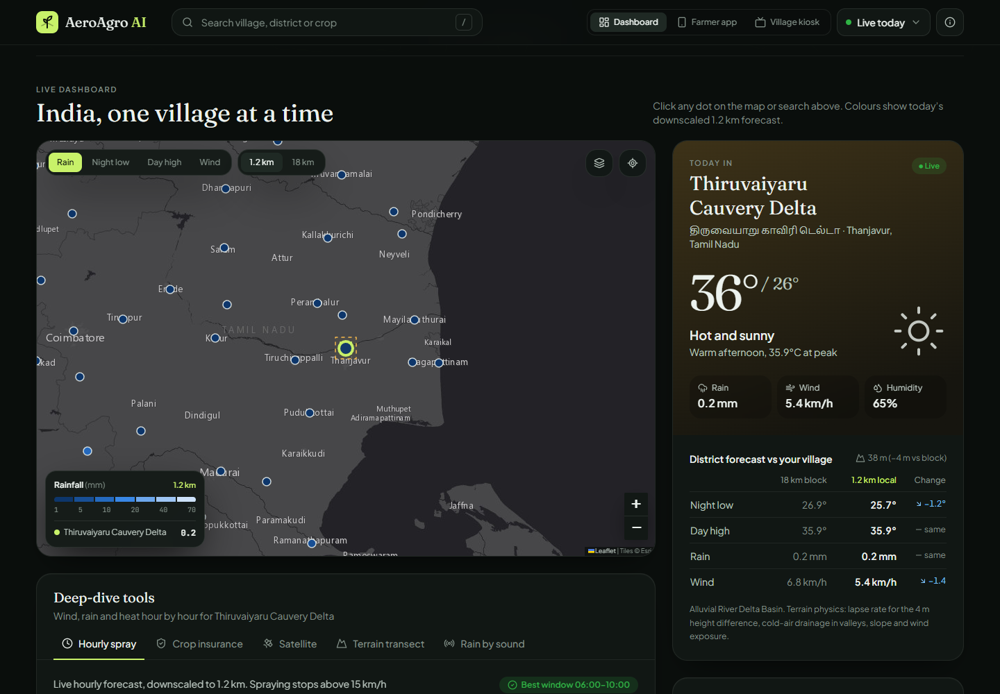
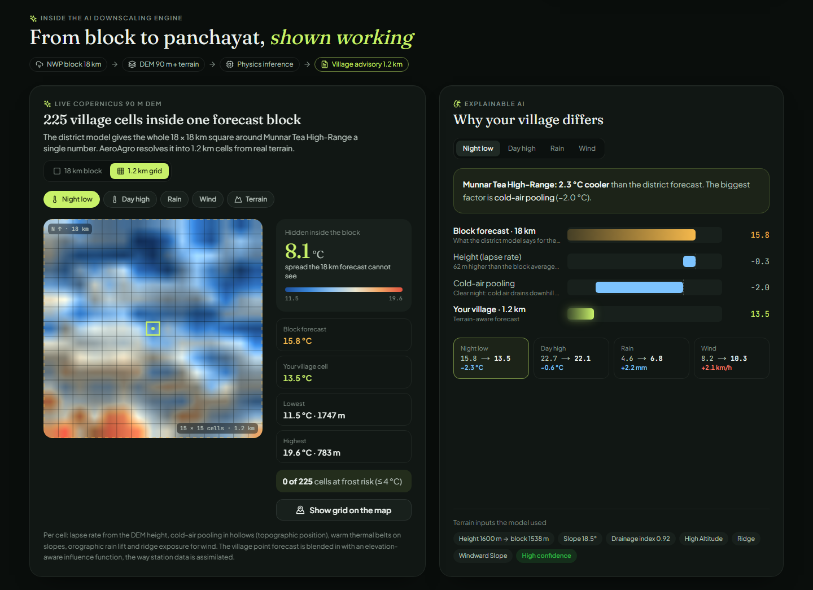

# AeroAgro AI: Panchayat-level weather downscaling

**Hyper-local weather and crop advisories for every Gram Panchayat in India.**

**Website:** https://aeroagro.vercel.app · mirror: https://barath178.github.io/panchayat-weather-downscaling/

Official forecasts are issued on 12–25 km grids, so a frost hollow, a rain-shadow village and a hillside tea estate inside one block all get the same number. AeroAgro AI takes that coarse forecast and downscales it to about 1.2 km using terrain physics (elevation lapse rate, cold-air drainage, orographic lift, wind-gap funnelling, urban heat island). It then turns the result into decisions a farmer can act on: when to spray, whether to irrigate, which pest to watch for, and evidence for PMFBY crop-insurance claims.



## MoES problem statement

> *Downscaling of weather forecast from Block level to Panchayat level: inferring high-resolution plots / data / information from low-resolution variables for agro-meteorological advisory services.*

| Requirement | How AeroAgro answers it |
|---|---|
| Block → panchayat | The 18 km forecast block around each village is resolved into **225 cells of 1.2 km** using live Copernicus GLO-90 DEM heights (Open-Meteo elevation API), shown as a card and as a map layer. |
| High-res from low-res | Physics-informed inference per cell (lapse rate, cold-air pooling from topographic position, thermal belts, orographic lift, ridge exposure), blended with the village point forecast through an elevation-aware structure function (as in MET Norway's gridpp). |
| Explainability | **Explainable AI waterfall**: every step from the block value to the village value, with the reason and its size, for night low, day high, rain and wind. |
| Agromet advisory | **7-day village outlook** with best spray day, dry spell and alerts; a printable **GKMS-format agromet bulletin** (5-day table, field operations, irrigation water balance, crop protection, livestock, SMS text, QR, SHA-256). |
| Reaching farmers | **Ask AeroAgro**: an on-device assistant that answers typed or spoken questions in English, हिन्दी and தமிழ் from the downscaled forecast, and reads answers aloud. |
| National scale | **AI scan of 303 villages**: counts heavy rain, frost, heat, spray-drift and fungal-weather alerts and the ones the district forecast misses. |

Share any village directly with `?v=<region id>`, e.g. `?v=kerala_idukki_227` for Munnar.



## Features

| | |
|---|---|
| **Live forecast** | "Live Today" mode pulls the real Open-Meteo forecast (grid-cell mean, `elevation=nan`) for the selected region and a batched national grid for all 303 regions. It falls back to seasonal climatology offline. |
| **Terrain downscaling** | Block (18 km) vs panchayat (1.2 km) values side by side, with the applied Δz correction shown. |
| **GIS map** | 303 districts and metros coloured by rain, min/max temperature or wind, at 1.2 km or 18 km. Dark, relief, satellite and road basemaps. IMD INSAT-3DR satellite overlay. GPS "my location". |
| **Spray window** | Hourly 06:00–19:00 status (safe / caution / do not spray) from wind drift, rain wash-off, heat and leaf wetness, plus the best continuous window. |
| **Agronomy** | FAO-56 Hargreaves ET₀, irrigation deficit, crop-specific disease rules (rice blast, downy mildew, apple scab, blister blight, yellow rust…). |
| **PMFBY evidence** | Weather-index trigger check at both resolutions, printable report with a SHA-256 checksum. |
| **Farmer delivery** | WhatsApp advisory in English, हिन्दी and தமிழ், voice read-out, Kisan mobile view, and a Panchayat kiosk wallboard with a scannable QR code. |
| **Extras** | Pan-India elevation transect, acoustic tin-roof rain gauge demo (Web Audio FFT). |

## Tech stack

| Layer | Technology |
|---|---|
| Frontend | Next.js 14, React 18, Tailwind CSS, Recharts, Leaflet |
| Physics engine | TypeScript (`frontend/src/lib/microclimate.ts`), runs in the browser |
| Backend API | FastAPI (Python) with an XGBoost / Random Forest tabular downscaler |
| Data | Open-Meteo NWP, NASA SRTM 30 m DEM, Sentinel-2 NDVI, ERA5-Land, IMD INSAT-3DR |
| Database | Supabase PostgreSQL + PostGIS |
| Training | Google Colab (`backend/notebooks/colab_training.py`) |

## Project structure

```
panchayat-weather-downscaling/
├── frontend/                  Next.js dashboard (main app)
│   └── src/
│       ├── app/page.tsx       Page: state, live data, wiring
│       ├── lib/microclimate.ts  Downscaling physics, spray rules, ET₀, pest rules
│       ├── lib/useLiveForecast.ts  Open-Meteo live + national fetch (cached 30 min)
│       ├── lib/advisory.ts    Multilingual WhatsApp / voice advisory
│       ├── lib/blockGrid.ts   Live DEM → 15 × 15 grid of 1.2 km cells inside the block
│       ├── lib/week.ts        7-day village outlook, IMD rain classes, alerts
│       ├── lib/assistant.ts   Ask AeroAgro: multilingual intent + day parsing, grounded answers
│       ├── components/        Map, charts, PMFBY, kiosk, mobile view…
│       └── data/all_india_regions.ts  303 regions with terrain covariates
├── backend/                   FastAPI service
│   ├── app/main.py            REST endpoints
│   ├── app/ml/downscaler.py   Tabular downscaler
│   └── app/services/          Open-Meteo ingestion, advisory rules
├── supabase/migrations/       PostGIS schema
├── design/                    Figma-ready design file + screenshots
├── scripts/                   Data and design generators
└── index.html, js/, css/      Standalone zero-install demo (open in a browser)
```

## Run it

### Frontend (main app)
```bash
cd frontend
npm install
npm run dev          # http://localhost:3000
```
No API keys are needed. Live weather comes from Open-Meteo's free API.

### Backend (optional)
```bash
cd backend
pip install -r requirements.txt
uvicorn app.main:app --reload --port 8000   # Swagger UI at http://localhost:8000/docs
```
Endpoints: `GET /health`, `GET /api/v1/panchayats`, `GET /api/v1/downscale`, `POST /api/v1/advisory`.

### Database (optional)
Create a Supabase project and run [`supabase/migrations/001_init_postgis.sql`](supabase/migrations/001_init_postgis.sql) in the SQL editor.

### Standalone demo
Open [`index.html`](index.html) directly in a browser. No install needed.

## Deploy

**Live site:** https://aeroagro.vercel.app (mirror: https://barath178.github.io/panchayat-weather-downscaling/)

- **Frontend → GitHub Pages** (what the live demo uses):
  ```bash
  cd frontend
  npm run build:pages          # static export to frontend/out, served under /panchayat-weather-downscaling/
  ```
  Then publish `frontend/out` (with an empty `.nojekyll` file) to the `gh-pages` branch.
- **Frontend → Vercel:** import the repo, set **Root Directory** to `frontend`, and deploy. No environment variables are required.
- **Backend → Render / Railway:** root `backend`, start command `uvicorn app.main:app --host 0.0.0.0 --port $PORT`.

## Design (Figma)

[`design/aeroagro_figma_design.svg`](design/aeroagro_figma_design.svg) is a vector file you can import into Figma (**File → Import**, or drag onto the canvas). Every group becomes a named layer and all text stays editable. It contains:

1. Design system: colour tokens, status colours, data ramps, type scale, components
2. Desktop GIS dashboard (1920 × 1080)
3. Kisan mobile (390 × 844)
4. Panchayat kiosk wallboard
5. Backend & data architecture, plus the 6-step downscaling pipeline
6. FastAPI reference
7. Reference screenshots of the running app

Regenerate it after UI changes with `node scripts/generate_figma_design.js`. The same file is served from the dashboard's **Figma artboard** button.

## Notes

Downscaled values are physics-based estimates for decision support, not an official IMD forecast. "Live Today" uses real forecasts. Monsoon, Winter Frost and Pre-Monsoon are climatological scenarios for demonstration. The PMFBY report is supporting evidence, not an insurer's decision.
